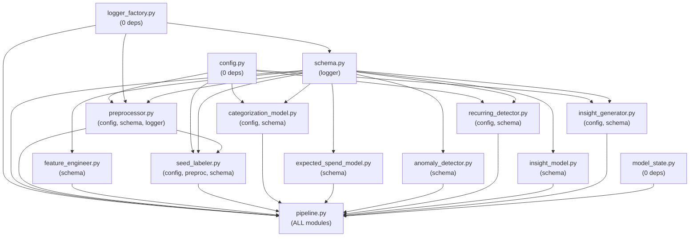

# Insight Engine — Architectural Deep Dives
**Audience**: Engineers who need to modify, extend, or audit this code.


> Detailed technical explanations of complex subsystems, design decisions,  
> and non-obvious architectural patterns in the Insight Engine.

---

## Table of Contents

1. [Leakage Prevention Architecture](#1-leakage-prevention-architecture)
2. [Merchant Alias Resolution Strategy](#2-merchant-alias-resolution-strategy)
3. [Dual-Gate Anomaly Detection](#3-dual-gate-anomaly-detection)
4. [Recurring Transaction Scoring Model](#4-recurring-transaction-scoring-model)
5. [Model Security System](#5-model-security-system)
6. [Insight Ranking: 1−P(no_action) Design](#6-insight-ranking-1pno_action-design)
7. [Pseudo-Label Tier Disambiguation](#7-pseudo-label-tier-disambiguation)
8. [History-Aware Inference Pipeline](#8-history-aware-inference-pipeline)
9. [Training Data Generation Strategy](#9-training-data-generation-strategy)
10. [Diversity-Preserving Insight Selection](#10-diversity-preserving-insight-selection)
11. [Schema Contract System](#11-schema-contract-system)
12. [Structured Logging & Observability](#12-structured-logging--observability)
13. [Model Persistence & Versioning](#13-model-persistence--versioning)
14. [Dependency Graph & Coupling Analysis](#14-dependency-graph--coupling-analysis)

---

## 1. Leakage Prevention Architecture

### Problem
In time-series financial data, using future information to compute features for past transactions creates data leakage. A model trained on leaked features performs artificially well during evaluation but fails in production, where future data doesn't exist.

### Where Leakage Can Occur

| Component | Leakage Vector | Mitigation |
|-----------|---------------|------------|
| Rolling features | Row i's rolling window includes row i's own value | `shift(1)` before `.rolling()` |
| NaN filling | Filling rolling NaN with full-dataset statistics | External `global_mean`/`global_std` injected from training set |
| Z-score | Using rolling stats that include current row | Z-score uses shifted rolling values |
| Feature engineering in inference | New transaction sees its own value in rolling computation | `engineer_features_inference` concatenates history first |

### Implementation Detail: `shift(1)` + `.rolling()`

```python
# feature_engineer.py, line 102
shifted = df[amount_col].shift(1)
df[Col.ROLLING_7D_MEAN] = shifted.rolling(window=7, min_periods=1).mean()
```

**What happens**:
- `shift(1)` moves every value one position forward, inserting NaN at index 0.
- `.rolling(7)` on the shifted series means row i's window covers indices [i-7, i-1] of the original series.
- Row i's own value is NEVER inside its own window.

**Edge case**: For the first row (index 0), `shift(1)` produces NaN. `min_periods=1` allows the rolling computation to proceed with available data, but the result for row 0 is always NaN (no prior data). This NaN is later filled by `fill_rolling_nulls()`.

### NaN Fill Protocol
```python
# feature_engineer.py, line 131-143
df[col_name] = df[col_name].fillna(global_mean)  # Rolling means
df[Col.ROLLING_7D_STD] = df[Col.ROLLING_7D_STD].fillna(
    global_std if global_std and global_std > 0 else 1.0
)
```

The `global_mean` and `global_std` parameters are:
- **Computed in `pipeline.py`** (line 122-123) from `debits["signed_amount"]` BEFORE any train/test split.
- **Passed as arguments** to `engineer_features()`. They are NEVER re-derived inside the function.
- For inference, these come from the stored `InsightModelState`.

This ensures test-set NaN values are filled with training-set statistics, not test-set statistics.

### Why Not Just Use `expanding()`?
An expanding window naturally avoids leakage, but expanding windows grow indefinitely. In production with months of history, expanding means becomes insensitive to recent behavior changes. A fixed 7-day / 30-day window captures behavioral recency while `shift(1)` prevents leakage.

---

## 2. Merchant Alias Resolution Strategy

### Problem
Indian bank statement narrations are deeply polluted. A single Swiggy order might appear as:
```
UPI/CR/436928374/Swiggy/8928374928@ybl/HDFC Bank
```

This contains: payment router (UPI), reference numbers, merchant name, VPA ID, bank name. Only "Swiggy" has semantic value.

### Two-Phase Resolution Architecture

The system uses a deliberately ordered two-phase approach in `preprocessor.clean_remark()`:

**Phase 1: Specific Merchant Match (170 patterns)**
```python
for compiled_re, alias in _COMPILED_SPECIFIC:
    if compiled_re.search(text):
        return alias.lower()  # FULL REPLACEMENT + EARLY EXIT
```
- Scans the lowercased raw remark against 170 specific merchant patterns.
- On FIRST match: returns the canonical alias immediately. The original remark is completely discarded.
- Order independence: specific merchant names are unique enough that collision between patterns is not a concern.

**Phase 2: Generic Router Substitution (14 patterns)**
```python
for compiled_re, alias in _COMPILED_GENERIC:
    if compiled_re.search(text):
        text = compiled_re.sub(" ", text)  # STRIP, don't replace
```
- Only reached if NO specific merchant matched.
- Strips routing noise (UPI, NEFT, IMPS references) from the text WITHOUT replacing the entire remark.
- The stripped text then falls through to standard deduplication (email removal, digit removal, noise token removal).

### Why Specific Merchants Return Early

If both "UPI" (generic) and "Swiggy" (specific) appear in a remark, we want "swiggy" as the cleaned output, not the generic UPI routing. The early return ensures the specific merchant identity is preserved.

### Why Generic Routers Don't Return

If only generic routing appears (e.g., `UPI/CR/436928374/RANDOM_MERCHANT`), returning "UPI Transfer" would destroy the unique merchant identity. Instead, the routing text is stripped, and "RANDOM_MERCHANT" falls through to standard cleaning — preserving whatever merchant-like text remains.

### Compilation Strategy
All regex patterns are compiled at module load time (`_COMPILED_SPECIFIC`, `_COMPILED_GENERIC`) into lists of `(re.Pattern, str)` tuples. This avoids re-compilation per transaction. With 184 patterns × N transactions, this saves significant CPU time.

---

## 3. Dual-Gate Anomaly Detection

### Problem
Simple z-score thresholding produces false positives: a ₹5 transaction against a ₹2 rolling mean has a high z-score but zero financial significance. Similarly, a large expected-spend residual on a normal-range transaction is likely a model artifact, not a real anomaly.

### Composite Heuristic

```python
is_spike = (
    (df["amount_zscore"].abs() > zscore_threshold)    # Gate 1
    & (df["percent_deviation"].abs() > pct_dev_threshold)  # Gate 2
)
```

| Gate | Source | Meaning |
|------|--------|---------|
| Z-score > 3.0 | `feature_engineer` → rolling stats | Transaction is statistically unusual relative to recent 7-day spending |
| Percent deviation > 0.5 | `expected_spend_model` → RidgeCV residual | Transaction amount is 50%+ away from what the ML model expected |

**Both gates must fire simultaneously.** This eliminates:
- Low-value statistical outliers (Gate 1 fires, Gate 2 doesn't).
- Model prediction errors on normal transactions (Gate 2 fires, Gate 1 doesn't).

### Why `.abs()` on Both Gates
The system catches anomalies in BOTH directions:
- **Positive anomalies**: spending spikes (₹50,000 when norm is ₹5,000).
- **Negative anomalies**: unusually low spending (₹50 when norm is ₹5,000), which can indicate subscription cancellations or behavioral shifts.

### Division Safety in Percent Deviation
```python
# expected_spend_model.py, line 125
safe_expected = df["expected_amount"].abs().clip(lower=1.0)
```
- `abs()` prevents sign inversion when RidgeCV extrapolates a negative expected amount.
- `clip(lower=1.0)` prevents division by zero when the expected amount is near zero.
- These edge cases are logged with counts.

---

## 4. Recurring Transaction Scoring Model

### Problem
Identifying subscriptions from raw bank data requires distinguishing genuinely recurring charges from coincidental same-merchant purchases. A user might buy from Swiggy 50 times but at random intervals — that's not a subscription.

### Three-Component Scoring System

The system evaluates each merchant group on 3 orthogonal dimensions:

#### Amount Score (A) — "How stable is the charge?"
```python
amount_drift = (amounts.max() - amounts.min()) / mean_amt
raw_A = 1.0 - (amount_drift / amount_tolerance)
A = clamp(raw_A)  # [0, 1]
```
- `amount_tolerance = 0.20` (20% drift allowed).
- Perfect subscription (same amount every time): drift=0, A=1.0.
- ±20% varying amounts: drift=0.20, A=0.0.
- Amounts varying > 20%: A=0.0 (clamped).

#### Temporal Score (T) — "How predictable is the timing?"
```python
for k, v in RECURRING_CONFIG.items():
    if v["min_gap"] <= mean_gap <= v["max_gap"]:
        assigned_freq = v["type"]
        raw_T = 1.0 - (var / v["var"])
        break
T = clamp(raw_T)  # [0, 1]
```

| Frequency | Mean Gap Range | Max Variance |
|-----------|---------------|--------------|
| Weekly | 6–8 days | 3 |
| Biweekly | 13–16 days | 5 |
| Monthly | 27–33 days | 10 |
| Quarterly | 85–95 days | 20 |

- If `mean_gap` doesn't fall in any bucket, T=0 and the group is rejected.
- Low variance (predictable timing) → T ≈ 1.0.
- High variance (erratic timing) → T → 0.0.

#### Volume Score (V) — "How many occurrences?"
```python
V = clamp(len(group) / 12.0)  # [0, 1]
```
- 12 occurrences (monthly for a year) = V=1.0.
- 3 occurrences (minimum threshold) = V=0.25.
- Acts as a confidence multiplier — more data points = more reliable.

#### Final Score and Rejection Logic
```python
if T == 0.0 or A == 0.0:
    continue  # REJECT — hard gates
score = (0.4 * A) + (0.4 * T) + (0.2 * V)
```

The weighting `(0.4, 0.4, 0.2)` reflects design intent:
- Amount stability and temporal regularity are equally important (40% each).
- Volume is a supporting signal, not a primary one (20%).
- The hard rejection on T=0 or A=0 prevents wildly varying or randomly timed transactions from sneaking through with a high volume score.

---

## 5. Model Security System

### Threat Model
The Insight Ranker is loaded from disk via `pickle.load()`, which executes arbitrary Python during deserialization. An attacker who can modify `models/insight_ranker.pkl` achieves Remote Code Execution (RCE).

### Three-Layer Defense

#### Layer 1: Path Canonicalization
```python
canonical = os.path.realpath(model_path)
if not canonical.startswith(models_dir + os.sep):
    raise ModelSecurityError(...)
```
- Resolves symlinks and `../` sequences.
- Validates the canonical path is within the `models/` directory.
- Prevents path traversal attacks where a crafted path like `models/../../etc/malicious.pkl` resolves outside the project.

#### Layer 2: SHA-256 Checksum Verification
```python
with open(checksum_path, "r") as f:
    expected = f.read().strip()
actual = _compute_checksum(model_path)
if actual != expected:
    raise ModelSecurityError(...)
```
- A companion `.sha256` file is generated during `train_and_save_models.py`.
- Before loading, the system recomputes the SHA-256 of the pickle file and compares it against the stored checksum.
- **Unsigned models are refused** (missing `.sha256` → return None).
- **Tampered models raise ModelSecurityError** (checksum mismatch → hard stop).

#### Layer 3: Graceful Degradation
- If the model file is missing entirely: `load_insight_ranker()` returns `None`.
- `predict_insight_scores()` handles `None` pipeline by defaulting all scores to 0.0.
- The pipeline continues to function using rule-based insight ordering instead of ML ranking.

### Attack Surface Remaining
- If an attacker can modify BOTH the `.pkl` and `.sha256` files, the checksum validation passes. This defense assumes the checksum file is stored with appropriate filesystem permissions.
- `pickle.load()` is inherently unsafe. A more secure alternative would be to use ONNX or a safe serialization format for the model weights only, avoiding arbitrary code execution during deserialization.

---

## 6. Insight Ranking: 1−P(no_action) Design

### Problem
The insight ranker is a 5-class classifier. How do you convert 5-class probabilities into a single "how insightful is this transaction?" score?

### Solution: Inverse No-Action Probability

```python
classes = list(pipeline.classes_)
if "no_action" in classes:
    idx = classes.index("no_action")
    scores = 1.0 - probs[:, idx]
```

P(no_action) represents the model's confidence that a transaction warrants NO insight. Therefore:
- `1 - P(no_action)` = confidence that SOME insight is warranted.
- Higher score → more interesting transaction.

### Why Not Use `probs.max(axis=1)`?
Using `max(probs)` gives the confidence in the predicted class. But a transaction with P(spending_spike)=0.4, P(subscription)=0.35, P(no_action)=0.25 should rank HIGHER than one with P(no_action)=0.8, P(spending_spike)=0.12. The `max(probs)` approach would give 0.4 vs 0.8, incorrectly ranking the boring transaction higher.

`1−P(no_action)` correctly gives: 0.75 (interesting) vs 0.2 (boring).

### Fallback
If `no_action` is not in the model's class list (unusual but defensively handled), the system falls back to `probs.max(axis=1)`.

---

## 7. Pseudo-Label Tier Disambiguation

### Problem
A transaction remark might match multiple keyword categories simultaneously. For example, "cred payment" matches both the `finance` category ("cred") and the `transfer` category ("payment"). Which label wins?

### Resolution: Priority Tier System

```python
# seed_labeler.py, _match_remark()
best_tier = min(m.priority for m in matches)  # LOWEST priority number = HIGHEST rank
tier_matches = [m for m in matches if m.priority == best_tier]
tier_matches.sort(key=lambda x: (-len(x.norm), x.norm))  # Longest match, then alphabetic
best_match = tier_matches[0]
```

**Step 1**: Select the tier with the lowest numeric priority (highest semantic priority).
- `finance` → priority 100 (HIGH_PRIORITY, index 0).
- `transfer` → priority 301 (LOW_PRIORITY, index 1).
- Winner: `finance` (priority 100 < 301).

**Step 2**: If multiple matches are in the same tier, select the LONGEST keyword (most specific).
- "cred payment" vs "cred": "cred payment" (14 chars) > "cred" (4 chars).

**Step 3**: If length ties, break alphabetically (deterministic).

### Confidence Signal
Each tier has a fixed confidence:
- HIGH → 1.0 (finance, health, utilities).
- MEDIUM → 0.8 (food, transport, shopping, entertainment).
- LOW → 0.6 (atm, transfer).
- Fallback → 0.0.

This confidence is stored in `label_confidence` and available for downstream analysis but is NOT directly used by the ML models. It serves as metadata for human interpretation and debugging.

---

## 8. History-Aware Inference Pipeline

### Problem
When a new transaction arrives for real-time scoring, its rolling features (7-day mean, 30-day mean, 7-day std) must reflect the user's actual spending history, not just the single new transaction.

### Tag-Based Row Tracking

```python
# feature_engineer.py, engineer_features_inference()
_TAG = "__is_new_txn__"
hist[_TAG] = False
new[_TAG] = True
combined = pd.concat([hist, new], ignore_index=True)

engineered = engineer_features(combined, ...)
result = engineered[engineered[_TAG]].drop(columns=[_TAG]).reset_index(drop=True)
```

**Why not use `.tail(n)`?**

`tail(n)` assumes new transactions have the latest dates. But `engineer_features` internally sorts by date. If a new transaction is backdated (e.g., a delayed bank posting from 3 days ago), it sorts into the middle of the combined DataFrame, not at the tail.

The `__is_new_txn__` boolean tag survives through all transformations (sorting, rolling, feature addition). After feature engineering on the combined set, we filter to tagged rows only — extracting exactly the new transactions with correctly computed historical rolling features.

### Memory Behavior
- `combined` is local to the function and goes out of scope.
- The tag column is dropped from the result before return.
- No persistent state is modified.

---

## 9. Training Data Generation Strategy

### Problem
The Insight Ranker and Tip Selector require labeled training data. Real bank statements are privacy-sensitive. The system must generate realistic synthetic data that mirrors production feature distributions.

### Architecture

```
_generate_base_features(n, rng)    → 14 feature columns, no labels
        ↓
_apply_labels(df, rng)             → Add insight_type + tip_id, adjust features
        ↓
_add_edge_cases(df, n_edge, rng)   → 500 deliberately ambiguous samples
        ↓
train_test_split(stratify=insight_type)
```

### Feature Distribution Calibration
Features are calibrated to match typical Indian bank statement patterns:
- **Amounts**: Lognormal(μ=6.0, σ=1.2), range ₹10–₹100,000. Median ~₹400.
- **Category weights**: food 22%, shopping 15%, transport 12%, finance 10%, utilities 10%, etc.
- **Category confidence**: Beta(5, 2) — skewed toward high confidence, reflecting a well-trained categorizer.

### Label-Feature Consistency
The system does NOT randomly assign labels independently of features. After assigning labels, it ADJUSTS features to be consistent:

| Label | Feature Adjustments |
|-------|-------------------|
| `spending_spike` | z-score ∈ [3, 5], deviation ∈ [0.5, 3], is_anomaly=1, amounts ∈ [₹500, ₹100K] |
| `subscription` | is_recurring=1, z-score ∈ [-1, 1], deviation ∈ [-0.1, 0.1], amounts ∈ {₹99, ₹149, ..., ₹1499} |
| `trend_warning` | rolling_7d_mean > rolling_30d_mean × 1.2, z-score ∈ [1, 2.5] |
| `budget_risk` | z-score ∈ [2, 3], deviation ∈ [0.2, 0.5] |
| `no_action` | z-score ∈ [-1.5, 1.5], deviation ∈ [-0.2, 0.2], all flags cleared |

This prevents the model from learning contradictions like "is_anomaly=0 but label=spending_spike".

### Edge Case Augmentation
500 additional samples stress decision boundaries:
1. Borderline z-scores (2.8–3.1) → budget_risk, not spike.
2. High z-score + ₹10 amount → no_action (trivial statistically unusual).
3. Regular-looking but high variance → no_action (not actually recurring).
4. Weekend context shifts → spending_spike.
5. Low-confidence categorization + anomaly signals → spending_spike.

---

## 10. Diversity-Preserving Insight Selection

### Problem
If all top-scoring transactions are anomalies, the user sees only spike warnings. If all are subscriptions, they see only recurring charge listings. Neither is useful alone.

### Two-Pass Selection Algorithm

```python
# insight_generator.py, generate_human_insights()

# Pass 1: Reserve one slot per type
for cand in candidates:
    if cand[1] not in seen_types:
        top_candidates.append(cand)
        seen_types.add(cand[1])

# Pass 2: Fill remaining quota by absolute score
for cand in candidates:
    if len(top_candidates) >= top_n:
        break
    if cand not in top_candidates:
        top_candidates.append(cand)
```

**Pass 1**: Iterates candidates (sorted by score). For each insight TYPE not yet seen, takes the highest-scoring representative. This guarantees at least one subscription insight and one anomaly insight make it to the final list.

**Pass 2**: Fills the remaining `top_n` slots with the absolute highest-scoring candidates regardless of type.

**Final sort**: Re-sorts the selected candidates by ML score for presentation order.

### Example
Given `top_n=5`:
- 3 spikes (scores: 0.9, 0.7, 0.6)
- 2 subscriptions (scores: 0.5, 0.3)

**Without diversity**: [0.9-spike, 0.7-spike, 0.6-spike, 0.5-sub, 0.3-sub]
**With diversity**: [0.9-spike, 0.5-sub] (Pass 1) → [0.9-spike, 0.7-spike, 0.6-spike, 0.5-sub] (Pass 2) → sorted: [0.9, 0.7, 0.6, 0.5]

The subscription at 0.5 is guaranteed a slot even though three spikes outrank it.

---

## 11. Schema Contract System

### Design Philosophy
The `Col` class + `require_columns()` function implement a formal Design by Contract pattern for DataFrames:

```
                   ┌─────────────┐
                   │  schema.py  │
                   │   Col class │
                   └──────┬──────┘
                          │ defines
          ┌───────────────┼───────────────┐
          ▼               ▼               ▼
  raw_input()    feature_engineer_input()  ...
  {date, amount, ...}   {date, amount, signed_amount}
          │               │
          ▼               ▼
  preprocessor      feature_engineer
  calls require_columns() at entry
```

### Why FrozenSet?
```python
@staticmethod
def raw_input() -> FrozenSet[str]:
    return frozenset({Col.DATE, Col.AMOUNT, Col.AMOUNT_FLAG, Col.REMARKS})
```
- `frozenset` is immutable. No caller can accidentally add/remove required columns.
- Set semantics allow `missing = required - set(df.columns)` for fast validation.

### Contract Enforcement Points
Every module validates its input contract at function entry, BEFORE any processing:
```python
# pattern repeated in every module
require_columns(df, Col.xxx_input(), "module_name")
```

This catches integration errors at the boundary between modules, providing clear error messages with the calling module name and the sorted list of missing/available columns.

---

## 12. Structured Logging & Observability

### Architecture
```
contextvars.ContextVar("pipeline_run_id") ← set once per pipeline invocation
        ↓
JSONFormatter.format(record) → {
    timestamp, level, logger, message,
    pipeline_run_id,     ← auto-injected
    event_type,          ← optional, from record
    metrics              ← optional dict, from record
}
```

### Usage Pattern in Modules
```python
logger.info(
    "Preprocessing complete.",
    extra={
        "event_type": "preprocessing_complete",
        "metrics": {"debits_count": len(debits), "credits_count": len(credits)}
    }
)
```

The `extra` dict allows `event_type` and `metrics` to be attached to the log record. `JSONFormatter` checks for these attributes and includes them in the JSON output.

### Run ID Correlation
```python
# pipeline.py calls at the top:
generate_new_run_id()
# → sets pipeline_run_id_ctx to "run_a3f8c2b1"
```

Every subsequent log line in that pipeline invocation automatically includes `"pipeline_run_id": "run_a3f8c2b1"`. This enables:
- Filtering all logs for a specific pipeline run.
- Correlating errors across modules in the same invocation.
- Distinguishing interleaved logs from concurrent pipeline runs.

### Handler Configuration
- `propagate = False`: Each module's logger does NOT forward messages to the root logger, preventing duplicate output when the root logger has its own handler (e.g., in test/notebook environments).
- `if not logger.handlers`: Guards against duplicate handler attachment when `get_logger()` is called multiple times for the same module name.

---

## 13. Model Persistence & Versioning

### InsightModelState Container
```python
@dataclass
class InsightModelState:
    pipeline_version: str         # "1.0.0"
    cat_pipeline: Optional[Pipeline]
    spend_pipeline: Optional[Pipeline]
    ranker_pipeline: Optional[Pipeline]
    global_mean: float
    global_std: float
```

### PII Prevention
`save_model_state()` explicitly type-checks `global_mean` and `global_std`:
```python
if not isinstance(state.global_mean, (float, np.floating)):
    raise TypeError(...)
```
This blocks the scenario where a developer accidentally stores a DataFrame (containing user transactions) as `global_mean`. Only scalar floats are allowed.

### Version Gate
```python
if payload.get("pipeline_version") != "1.0.0":
    raise ValueError(...)
```
Load-time validation ensures the persisted model was generated by a compatible pipeline version. If the feature schema changes in a future version, the version gate prevents loading incompatible models that would produce garbage predictions.

### Serialization Format
Uses `joblib.dump`/`joblib.load` for the model state container (handles sklearn pipelines efficiently with NumPy array serialization). The standalone insight ranker uses `pickle` directly for compatibility with the security checksum system.

---

## 14. Dependency Graph & Coupling Analysis

### Module Dependency DAG



### Coupling Characteristics

| Module | Fan-In | Fan-Out | Assessment |
|--------|--------|---------|------------|
| `config.py` | 0 | 5 | Pure data hub. No coupling risk. |
| `schema.py` | 1 | 9 | Maximally depended upon. Changes here ripple everywhere. |
| `pipeline.py` | 10 | 0 | Pure consumer. High fan-in is expected for an orchestrator. |
| `preprocessor.py` | 3 | 2 | Moderate coupling. `seed_labeler` imports `normalize()` directly. |
| `feature_engineer.py` | 1 | 1 | Well-isolated. Only depends on `schema`. |
| `anomaly_detector.py` | 1 | 1 | Minimal coupling. Only depends on `schema`. |

### Notable Coupling Point
`seed_labeler.py` imports `normalize()` from `preprocessor.py`. This creates a dependency from labeling to preprocessing. The function is used as a "boundary hardening measure" — re-normalizing remarks before matching even if they were already cleaned. If `preprocessor.normalize()` changes behavior, it affects both remark cleaning AND keyword matching simultaneously.

### No Circular Dependencies
The dependency graph is a strict DAG (Directed Acyclic Graph). No module imports from a downstream consumer. `pipeline.py` sits at the top as the sole orchestrator.
