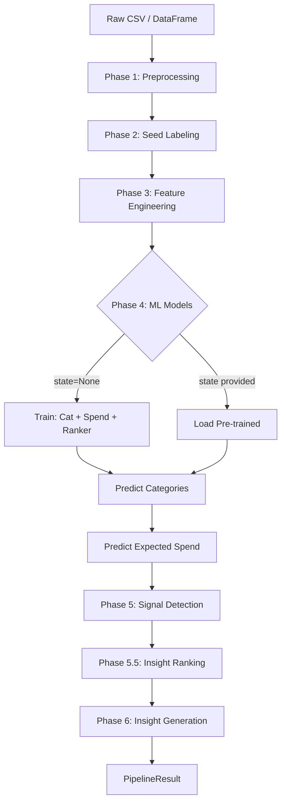

# Insight Engine — End-to-End Pipeline Execution Flow

> Micro-step trace from raw CSV ingestion to final insight output.  
> Covers both **Training+Inference** (`run_pipeline`) and **Inference-Only** (`run_inference`) paths.

**Audience**: A developer who needs to understand what happens at every step.


---

## Pipeline Modes

| Mode | Entry Point | Trains Models? | Requires History? |
|------|------------|----------------|-------------------|
| Training+Inference | `run_pipeline(raw_df)` | Yes (if `state=None`) | No |
| Inference-Only (pre-trained) | `run_pipeline(raw_df, state=...)` | No | No |
| Live Inference | `run_inference(new_txn, state, history_df)` | No | Yes |

---

## Master Flow Diagram



---

## Phase 1: Preprocessing

**Entry**: `preprocessor.preprocess(raw_df)`  
**Output**: `(debit_df, credit_df)` — two independently indexed DataFrames.

### Step-by-step execution:

```
Step 1.1  validate_schema(df)
          ├── require_columns(df, {date, amount, amount_flag, remarks})
          └── RAISES ValueError if any column missing
                  ↓
Step 1.2  coerce_and_validate_types(df)
          ├── df.copy()
          ├── pd.to_numeric(df["amount"], errors="coerce")
          │     └── Garbage strings → NaN
          ├── Count NaN rows → log warning with count
          └── DROP NaN rows, reset_index
                  ↓
Step 1.3  _parse_and_sort_dates(df)
          ├── df.copy()
          ├── pd.to_datetime(df["date"], format="%Y-%m-%d")
          │     └── RAISES ValueError if not strict ISO-8601
          ├── sort_values("date"), reset_index
          └── Log min_date, max_date
                  ↓
Step 1.4  _compute_signed_amount(df)
          ├── df.copy()
          ├── Apply _normalize_flag to each amount_flag:
          │     ├── str → strip → upper → "DR" or "CR"
          │     └── non-str / unrecognized → None
          ├── NaN flags → default to "DR" (log warning + count)
          └── signed_amount = np.where(flag=="DR", -|amount|, +|amount|)
                  ↓
Step 1.5  _drop_zero_amount(df)
          ├── Filter: df[amount != 0]
          └── Log dropped count
                  ↓
Step 1.6  _deduplicate(df)
          ├── drop_duplicates on (date, amount, remarks, amount_flag)
          │     └── keep="first"
          └── Log dropped count
                  ↓
Step 1.7  clean_remark(remark) applied to df["remarks"] → df["cleaned_remarks"]
          For each remark:
          ├── Guard: non-string/empty → ""
          ├── Lowercase
          ├── SPECIFIC merchant check (170 patterns):
          │     └── FIRST MATCH → return alias.lower() IMMEDIATELY
          │         (Full remark replacement — no further processing)
          ├── GENERIC router check (14 patterns):
          │     └── On match → STRIP routing text from string
          │         (Preserves underlying merchant identity)
          ├── Strip emails (_EMAIL_PATTERN)
          ├── Strip long digit runs (_LONG_DIGIT_PATTERN)
          ├── Strip special chars (_SPECIAL_CHAR_PATTERN)
          ├── Collapse whitespace
          └── Filter noise tokens (NOISE_TOKENS) + single-char tokens
                  ↓
Step 1.8  _split_debit_credit(df)
          ├── debits = df[amount_flag == "DR"], reset_index
          ├── credits = df[amount_flag == "CR"], reset_index
          └── Log counts
```

### Data shape after Phase 1:

```
Columns present:
  date | amount | amount_flag | remarks | balance* | signed_amount | cleaned_remarks
  (*balance if present in raw input)
```

---

## Phase 2: Seed Labeling

**Entry**: `seed_labeler.label_debits(debits)`, `seed_labeler.label_credits(credits)`

### Step-by-step execution:

```
Step 2.1  require_columns(df, {cleaned_remarks})
                  ↓
Step 2.2  Re-normalize: apply normalize() to cleaned_remarks
          ├── Strips ALL special characters (including @ and &)
          ├── Lowercases
          └── Collapses whitespace
          (Boundary hardening — safe even without preprocessor)
                  ↓
Step 2.3  For each normalized remark → _match_remark():
          ├── Empty remark → return fallback immediately
          ├── Scan ALL compiled keywords (precompiled regex with \b):
          │     └── Collect all pattern matches
          ├── No matches → return fallback
          ├── Sort matches by:
          │     1. priority (lowest = highest tier) → pick best tier
          │     2. keyword length (longest = most specific)
          │     3. lexicographic tiebreak
          └── Return (category, reason, keyword_text, keyword_norm, confidence)
                  ↓
Step 2.4  Write 5 columns per row:
          ├── pseudo_label       ← matched category or fallback
          ├── label_reason       ← "keyword_match_{tier}" or "fallback_{label}"
          ├── label_keyword      ← original keyword text
          ├── label_keyword_norm ← normalized keyword
          └── label_confidence   ← tier-based confidence (1.0/0.8/0.6/0.0)
                  ↓
Step 2.5  _log_coverage():
          ├── Count non-fallback rows / total
          └── WARN if coverage < 40% (MIN_COVERAGE_THRESHOLD)
```

### Credits labeling
Same flow with `CREDIT_KEYWORDS` and `FALLBACK_CREDIT_LABEL = "other_credit"`.

### Data shape after Phase 2:
```
Previous columns + pseudo_label | label_reason | label_keyword | label_keyword_norm | label_confidence
```

---

## Phase 3: Feature Engineering

**Entry (training)**: `feature_engineer.engineer_features(debits, global_mean, global_std)`  
**Entry (inference)**: `feature_engineer.engineer_features_inference(new_txn, history_df, global_mean, global_std)`

### Step-by-step execution (training path):

```
Step 3.0  Compute global_mean = debits["signed_amount"].mean()
          Compute global_std  = debits["signed_amount"].std()
          (Done in pipeline.py BEFORE calling engineer_features)
                  ↓
Step 3.1  Sort by date, reset_index (enforce chronological order)
                  ↓
Step 3.2  add_time_features(df):
          ├── is_weekend     ← dayofweek ∈ {5, 6} → 1, else 0
          ├── week_of_month  ← (day - 1) // 7 + 1
          ├── month_sin      ← sin(2π × month / 12)
          ├── month_cos      ← cos(2π × month / 12)
          ├── dow_sin        ← sin(2π × dayofweek / 7)
          └── dow_cos        ← cos(2π × dayofweek / 7)
                  ↓
Step 3.3  add_rolling_features(df, amount_col="amount"):
          ├── shifted = df["amount"].shift(1)     ← LEAKAGE PREVENTION
          ├── rolling_7d_mean  ← shifted.rolling(7,  min_periods=1).mean()
          ├── rolling_30d_mean ← shifted.rolling(30, min_periods=1).mean()
          └── rolling_7d_std   ← shifted.rolling(7,  min_periods=2).std()
                  ↓
Step 3.4  fill_rolling_nulls(df, global_mean, global_std):
          ├── rolling_7d_mean  NaN → global_mean
          ├── rolling_30d_mean NaN → global_mean
          └── rolling_7d_std   NaN → max(global_std, 1.0)
                  ↓
Step 3.5  add_amount_features(df, amount_col="amount"):
          ├── amount_log    ← log1p(|amount|)
          ├── safe_std      ← rolling_7d_std, replace 0 with 1.0
          └── amount_zscore ← ((amount - rolling_7d_mean) / safe_std).clip(-5, 5)
```

### Inference path (history-aware):
```
Step 3.INF.1  Tag new_txn rows with __is_new_txn__ = True
Step 3.INF.2  Tag history_df rows with __is_new_txn__ = False
Step 3.INF.3  Concatenate [history_df, new_txn]
Step 3.INF.4  Run engineer_features() on combined set
Step 3.INF.5  Filter result[__is_new_txn__ == True], drop tag column
```

### Data shape after Phase 3:
```
Previous columns + is_weekend | week_of_month | month_sin | month_cos
                 + dow_sin | dow_cos
                 + rolling_7d_mean | rolling_30d_mean | rolling_7d_std
                 + amount_log | amount_zscore
```

---

## Phase 4: ML Models

### Step 4.1: Categorization Model

**Training path**:
```
Step 4.1.T1  train_categorization_model(debits, label_col="pseudo_label"):
             ├── require_columns(df, {cleaned_remarks, amount_log})
             ├── Drop rows with NaN in critical columns
             ├── EXCLUDE fallback labels (uncategorized, other_credit)
             │     └── Prevents model from learning fallback as a real class
             ├── X = [cleaned_remarks, amount_log]
             ├── Build pipeline:
             │     ├── TfidfVectorizer(ngrams=(1,2), max_features=2000)
             │     ├── StandardScaler(with_mean=False)  ← preserves sparsity
             │     └── LogisticRegression(class_weight="balanced", max_iter=1000)
             └── pipeline.fit(X, y) → log training accuracy
```

**Prediction** (both paths):
```
Step 4.1.P1  predict_categories(cat_pipeline, debits):
             ├── X = [cleaned_remarks, amount_log], fill NaN
             ├── predicted_category ← pipeline.predict(X)
             └── category_confidence ← max(predict_proba(X), axis=1)
```

### Step 4.2: Expected Spend Model

**Training path**:
```
Step 4.2.T1  train_expected_spend_model(debits, target_col="amount"):
             ├── require_columns(df, {amount, predicted_category, rolling_7d_mean})
             ├── Drop rows with NaN
             ├── Build pipeline:
             │     ├── StandardScaler on 9 numeric features
             │     ├── OneHotEncoder(handle_unknown="ignore") on predicted_category
             │     └── RidgeCV(alphas=[0.1, 1.0, 10.0, 100.0])
             └── pipeline.fit(df, y) → log R² score
```

**Prediction** (both paths):
```
Step 4.2.P1  predict_expected_spend(spend_pipeline, debits):
             ├── Fill NaN in numeric → 0.0, category → "uncategorized"
             ├── expected_amount     ← pipeline.predict(df_pred)
             ├── residual            ← amount - expected_amount
             ├── safe_expected       ← |expected_amount|.clip(lower=1.0)
             │     └── Prevents div-by-zero and sign inversion
             └── percent_deviation   ← residual / safe_expected
```

### Data shape after Phase 4:
```
Previous columns + predicted_category | category_confidence
                 + expected_amount | residual | percent_deviation
```

---

## Phase 5: Signal Detection

### Step 5.1: Anomaly Detection

```
Step 5.1.1  detect_anomalies(debits, zscore_threshold=3.0, pct_dev_threshold=0.5):
            ├── require_columns(df, {amount_zscore, percent_deviation, amount})
            └── is_anomaly = (|amount_zscore| > 3.0) AND (|percent_deviation| > 0.5)
                              ↑ Statistical gate         ↑ Contextual gate
                              Both MUST fire. Single-gate misses are suppressed.
```

### Step 5.2: Recurring Transaction Detection

```
Step 5.2.1  find_recurring_transactions(debits, group_col="cleaned_remarks"):
            ├── require_columns(df, {cleaned_remarks, date, amount})
            ├── Sort by date
            ├── GROUP BY cleaned_remarks
            │
            For each group (if len >= 3):
            ├── time_diffs = date.diff().dt.days
            ├── mean_amount, amount_drift = (max-min)/mean
            │
            ├── Amount Score A = clamp(1.0 - drift/tolerance)    [0,1]
            │
            ├── Temporal Score T:
            │     ├── Compute mean_gap
            │     ├── Match to frequency bucket:
            │     │     weekly:    [6, 8]   days
            │     │     biweekly:  [13, 16] days
            │     │     monthly:   [27, 33] days
            │     │     quarterly: [85, 95] days
            │     └── T = clamp(1.0 - variance/expected_var)     [0,1]
            │
            ├── Volume Score V = clamp(count / 12)               [0,1]
            │
            ├── REJECTION: if T==0 OR A==0 → skip group
            │
            └── score = 0.4*A + 0.4*T + 0.2*V
                 ├── is_recurring = True (for all group rows)
                 ├── recurring_frequency = assigned bucket name
                 ├── recurring_confidence = score
                 └── recurring_score = score
```

### Data shape after Phase 5:
```
Previous columns + is_anomaly
                 + is_recurring | recurring_frequency | recurring_confidence | recurring_score
```

---

## Phase 5.5: ML Insight Ranking

```
Step 5.5.1  predict_insight_scores(ranker_pipeline, debits):
            ├── If ranker is None → insight_score = 0.0 for all rows
            │     └── Graceful degradation: rule-based ordering only
            │
            ├── require_columns(df, 14-column insight_ranker_input)
            ├── X = [13 numeric + 1 categorical features]
            ├── Fill NaN: numeric → 0.0, categorical → "unknown"
            ├── Align column order to pipeline.feature_names_in_ (if exposed)
            │
            ├── probs = pipeline.predict_proba(X)
            ├── Locate "no_action" class index
            └── insight_score = 1.0 - P(no_action)
                  ↑ Higher = more "insightful" transaction
```

### Data shape after Phase 5.5:
```
Previous columns + insight_score
```

---

## Phase 6: Insight Generation

```
Step 6.0  finalize_df(debits):
          └── Fill recurring_score NaN → 0.0

Step 6.0b _optimize_memory_footprint(debits):
          ├── predicted_category → pandas 'category' dtype
          └── is_weekend → bool dtype

Step 6.1  generate_human_insights(debits, top_n=10, seed=42):
          ├── rng = Random(42)     ← deterministic
          ├── require_columns(df, {is_anomaly, is_recurring})
          ├── If insight_score missing → default 0.0
          ├── Sort by date
          │
          ├── SUBSCRIPTIONS:
          │     ├── Filter: is_recurring == True
          │     ├── Group by cleaned_remarks
          │     └── For each group:
          │           ├── Select random template from INSIGHT_TEMPLATES["subscription"]
          │           ├── Format: merchant, amount (mean), frequency
          │           ├── Select tip via _select_tip("", "subscription", rng)
          │           └── Append (score, "subscription", text, tip) to candidates
          │
          ├── ANOMALIES:
          │     ├── Filter: is_anomaly == True
          │     └── For each row:
          │           ├── Select random template from INSIGHT_TEMPLATES["spending_spike"]
          │           ├── Format: category, merchant, amount, pct deviation, date
          │           ├── Select tip via _select_tip(category, "spending_spike", rng)
          │           └── Append (score, "spike", text, tip) to candidates
          │
          ├── DIVERSITY RANKING:
          │     ├── Sort candidates by score (descending)
          │     ├── Pass 1: Grab ONE insight per type (guarantees variety)
          │     └── Pass 2: Fill remaining top_n quota by score
          │
          └── OUTPUT:
                ├── Re-sort by ML score
                └── For each candidate: emit insight text + optional "> Tip: ..."
```

---

## Final Output: `PipelineResult`

```python
@dataclass(frozen=True)
class PipelineResult:
    debits:          pd.DataFrame    # Fully enriched debit transactions
    credits:         pd.DataFrame    # Labeled credit transactions
    insights:        List[str]       # Human-readable insight strings
    cat_pipeline:    Optional[Pipeline]  # Trained categorization model
    spend_pipeline:  Optional[Pipeline]  # Trained expected spend model
    ranker_pipeline: Optional[Pipeline]  # Trained insight ranker
    global_mean:     float           # Training-set signed_amount mean
    global_std:      float           # Training-set signed_amount std
```

### Final debit DataFrame columns (complete):
```
date | amount | amount_flag | remarks | balance* | signed_amount | cleaned_remarks
pseudo_label | label_reason | label_keyword | label_keyword_norm | label_confidence
is_weekend | week_of_month | month_sin | month_cos | dow_sin | dow_cos
rolling_7d_mean | rolling_30d_mean | rolling_7d_std | amount_log | amount_zscore
predicted_category | category_confidence
expected_amount | residual | percent_deviation
is_anomaly
is_recurring | recurring_frequency | recurring_confidence | recurring_score
insight_score
```

**Total columns accumulated: ~33 (debits), ~12 (credits).**

---

## Data Flow Summary

```mermaid
graph LR
    subgraph "Input"
        CSV["Bank CSV<br>4 columns"]
    end
    subgraph "Phase 1"
        PP["Preprocessor<br>+2 cols"]
    end
    subgraph "Phase 2"
        SL["Seed Labeler<br>+5 cols"]
    end
    subgraph "Phase 3"
        FE["Feature Engineer<br>+11 cols"]
    end
    subgraph "Phase 4"
        CM["Categorization<br>+2 cols"]
        ES["Expected Spend<br>+3 cols"]
    end
    subgraph "Phase 5"
        AD["Anomaly Detector<br>+1 col"]
        RD["Recurring Detector<br>+4 cols"]
    end
    subgraph "Phase 5.5"
        IR["Insight Ranker<br>+1 col"]
    end
    subgraph "Phase 6"
        IG["Insight Generator<br>→ text strings"]
    end
    
    CSV --> PP --> SL --> FE --> CM --> ES --> AD --> RD --> IR --> IG
```



---

## Error Propagation Map

| Phase | Failure Mode | Behavior |
|-------|-------------|----------|
| 1 | Missing required columns | `ValueError` — hard stop |
| 1 | Unparseable dates | `ValueError` — hard stop |
| 1 | Unparseable amounts | Drop rows + log warning |
| 1 | Invalid amount_flag | Default to "DR" + log warning |
| 2 | No keyword matches | Assign fallback label, log if coverage < 40% |
| 3 | ≤1 row DataFrame | Rolling features all NaN → filled with global stats |
| 3 | Zero rolling_std | Replace with 1.0 for z-score computation |
| 4 | Missing model file | Return None → downstream uses fallback scoring |
| 4 | Checksum mismatch | `ModelSecurityError` — hard stop |
| 4 | Expected_amount ≈ 0 | Clip |expected| to 1.0 for percent_deviation |
| 5 | Both anomaly gates miss | Transaction not flagged (correct behavior) |
| 5 | Group < 3 occurrences | Skip recurring detection for that merchant |
| 5.5 | No ranker pipeline | All scores default to 0.0 |
| 6 | No anomalies/recurring found | Empty insights list returned |
