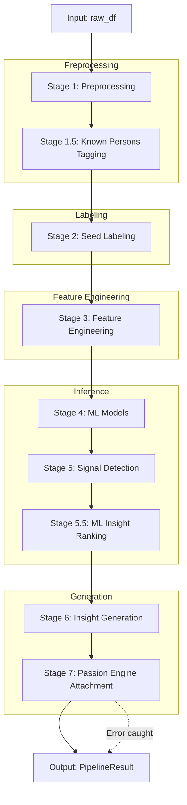

# Pipeline: Insight Engine Core

## Entry Point
- **File**: `pipeline.py`
- **Trigger**: `run_pipeline(raw_df)`
- **Input**: `raw_df` (pandas DataFrame containing bank statement data)

## Stage Map

## Stage Details

### Stage 1 — Preprocessing
- **Files involved**: `pipeline.py`, `preprocessor.py`
- **Functions called**: `preprocessor.py::preprocess`
- **Input**: `raw_df` (pandas DataFrame)
- **Output**: `debits`, `credits` (pandas DataFrames)
- **I/O operations**: None
- **Shared state touched**: None
- **Failure behavior**: Unhandled exception propagates to core try/except block.
- **Retry / fallback**: None

### Stage 1.5 — Known Persons Tagging
- **Files involved**: `pipeline.py`, `known_persons.py`
- **Functions called**: `known_persons.py::tag_known_persons`, `known_persons.py::log_unmatched_recurring_transfers`, `known_persons.py::_enforce_known_person_schema`
- **Input**: `debits`, `credits` (pandas DataFrames)
- **Output**: `debits`, `credits` with `Col.IS_KNOWN_PERSON` column populated.
- **I/O operations**: None
- **Shared state touched**: None
- **Failure behavior**: Unhandled exception propagates to core try/except block.
- **Retry / fallback**: None

### Stage 2 — Seed Labeling
- **Files involved**: `pipeline.py`, `seed_labeler.py`
- **Functions called**: `seed_labeler.py::label_debits`, `seed_labeler.py::label_credits`
- **Input**: `spend_debits`, `spend_credits` (pandas DataFrames where `IS_KNOWN_PERSON` is false)
- **Output**: DataFrames with `Col.PSEUDO_LABEL` populated.
- **I/O operations**: None
- **Shared state touched**: None
- **Failure behavior**: Unhandled exception propagates to core try/except block.
- **Retry / fallback**: None

### Stage 3 — Feature Engineering
- **Files involved**: `pipeline.py`, `feature_engineer.py`
- **Functions called**: `feature_engineer.py::engineer_features`
- **Input**: `spend_debits` (pandas DataFrame)
- **Output**: DataFrame with added features (`ROLLING_7D_MEAN`, etc.)
- **I/O operations**: None
- **Shared state touched**: None
- **Failure behavior**: Unhandled exception propagates to core try/except block.
- **Retry / fallback**: None

### Stage 4 — ML Models
- **Files involved**: `pipeline.py`, `categorization_model.py`, `expected_spend_model.py`
- **Functions called**: `train_models` (if no state provided), `categorization_model.py::predict_categories`, `expected_spend_model.py::predict_expected_spend`
- **Input**: `spend_debits` (pandas DataFrame)
- **Output**: DataFrame with predicted categories and expected spend columns.
- **I/O operations**: None
- **Shared state touched**: None
- **Failure behavior**: Unhandled exception propagates to core try/except block.
- **Retry / fallback**: None

### Stage 5 — Signal Detection
- **Files involved**: `pipeline.py`, `anomaly_detector.py`, `recurring_detector.py`
- **Functions called**: `anomaly_detector.py::detect_anomalies`, `recurring_detector.py::find_recurring_transactions`
- **Input**: `spend_debits` (pandas DataFrame)
- **Output**: DataFrame with `IS_ANOMALY`, `IS_RECURRING` columns populated.
- **I/O operations**: None
- **Shared state touched**: None
- **Failure behavior**: Unhandled exception propagates to core try/except block.
- **Retry / fallback**: None

### Stage 5.5 — ML Insight Ranking
- **Files involved**: `pipeline.py`, `insight_model.py`
- **Functions called**: `insight_model.py::predict_insight_scores`
- **Input**: `spend_debits` (pandas DataFrame)
- **Output**: DataFrame with insight scoring columns.
- **I/O operations**: Read `models/insight_ranker.pkl` and SHA-256 (if not passed via state).
- **Shared state touched**: None
- **Failure behavior**: Unhandled exception propagates to core try/except block.
- **Retry / fallback**: None

### Stage 6 — Insight Generation
- **Files involved**: `pipeline.py`, `insight_generator.py`, `known_persons.py`
- **Functions called**: `insight_generator.py::generate_human_insights`, `known_persons.py::detect_personal_patterns`
- **Input**: `spend_debits`, `personal_mask` slices of `debits`
- **Output**: `insights` list (Strings)
- **I/O operations**: None
- **Shared state touched**: None
- **Failure behavior**: Unhandled exception propagates to core try/except block.
- **Retry / fallback**: None

### Stage 7 — Passion Engine Attachment
- **Files involved**: `pipeline.py`, `passion_pipeline.py`
- **Functions called**: `pipeline.py::_attach_passion_results` -> `passion_pipeline.py::process_pipeline`
- **Input**: Core `PipelineResult` containing `debits` DataFrame
- **Output**: Modified `PipelineResult` with passion fields added (or unmodified if disabled/failed).
- **I/O operations**: Read environment variables.
- **Shared state touched**: None
- **Failure behavior**: `_attach_passion_results` catches all exceptions (unless `strict_attach=True`) and returns unmodified core result.
- **Retry / fallback**: Fallback is unmodified Core `PipelineResult`.

## Full Execution Trace
`pipeline.py::run_pipeline`
  → `preprocessor.py::preprocess`
  → `known_persons.py::tag_known_persons`
  → (if spend_mask) `seed_labeler.py::label_debits`
  → (if credit_spend_mask) `seed_labeler.py::label_credits`
  → `known_persons.py::_enforce_known_person_schema`
  → (if spend_mask) `feature_engineer.py::engineer_features`
  → (if state is None) `pipeline.py::train_models`
  → (if spend_mask) `categorization_model.py::predict_categories`
  → (if spend_mask) `expected_spend_model.py::predict_expected_spend`
  → (if spend_mask) `anomaly_detector.py::detect_anomalies`
  → (if spend_mask) `recurring_detector.py::find_recurring_transactions`
  → (if spend_mask) `insight_model.py::predict_insight_scores`
  → `pipeline.py::finalize_df`
  → `pipeline.py::_optimize_memory_footprint`
  → (if spend_mask) `insight_generator.py::generate_human_insights`
  → `known_persons.py::detect_personal_patterns`
  → `pipeline.py::_attach_passion_results`
     → `passion_pipeline.py::process_pipeline`
