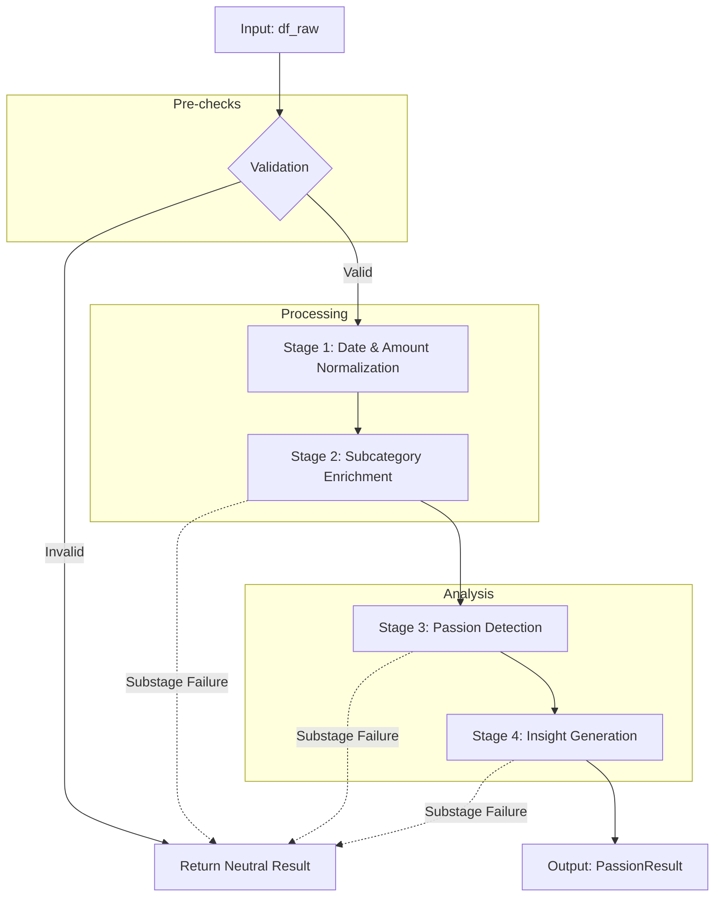

# Pipeline: Passion Engine

## Entry Point
- **File**: `passion_pipeline.py`
- **Trigger**: `process_pipeline(df_raw, strict_mode=True, rng=None, allow_yyyymmdd_dates=False)`
- **Input**: `df_raw` (pandas DataFrame containing debits)

## Stage Map

## Stage Details

### Pre-checks: Validation
- **Files involved**: `passion_pipeline.py`
- **Functions called**: `passion_pipeline.py::process_pipeline` pre-check block
- **Input**: `df_raw` (pandas DataFrame)
- **Output**: Unchanged `df_raw` or early return
- **I/O operations**: Read `INSIGHT_ENGINE_PASSION_MAX_ROWS`
- **Shared state touched**: None
- **Failure behavior**: Returns `_neutral_passion_result` if empty or below `PASSION_MIN_DEBIT_ROWS`. Raises ValueError if above `max_rows` (in strict mode).
- **Retry / fallback**: Return neutral result.

### Stage 1 — Date & Amount Normalization
- **Files involved**: `passion_pipeline.py`
- **Functions called**: `passion_pipeline.py::_normalize_ts`, `passion_pipeline.py::_is_unparseable_amount`, `passion_utils.py::safe_numeric`
- **Input**: `work_df` (pandas DataFrame copy)
- **Output**: `_detection_dates` series, `amount_numeric` series, `valid_amount_mask`
- **I/O operations**: None
- **Shared state touched**: None
- **Failure behavior**: Propagates error in strict mode.
- **Retry / fallback**: None

### Stage 2 — Subcategory Enrichment
- **Files involved**: `passion_pipeline.py`, `marketplace_subcategory.py`
- **Functions called**: `marketplace_subcategory.py::enrich_subcategories`
- **Input**: `enrich_df` (pandas DataFrame copy with cleaned amounts)
- **Output**: `work_df` with appended `SUBCATEGORY`, `SUBCATEGORY_CONFIDENCE`, `IS_PASSION_ELIGIBLE` columns.
- **I/O operations**: None
- **Shared state touched**: None
- **Failure behavior**: Caught by `try...except`. In strict mode, error is re-raised. In soft mode, returns `_neutral_passion_result` immediately (fail-fast).
- **Retry / fallback**: Neutral result in soft mode.

### Stage 3 — Passion Detection
- **Files involved**: `passion_pipeline.py`, `marketplace_subcategory.py`, `passion_detector.py`
- **Functions called**: `marketplace_subcategory.py::resolve_merchant_vectorized`, `passion_detector.py::detect_passions`
- **Input**: `detect_df` (pandas DataFrame copy)
- **Output**: List of `PassionSignal` objects
- **I/O operations**: None
- **Shared state touched**: None
- **Failure behavior**: Caught by `try...except`. Re-raised in strict mode, returns neutral result in soft mode.
- **Retry / fallback**: Neutral result in soft mode.

### Stage 4 — Insight Generation
- **Files involved**: `passion_pipeline.py`, `passion_insight_generator.py`
- **Functions called**: `passion_insight_generator.py::generate_passion_insights`
- **Input**: List of `Candidate` objects
- **Output**: List of strings (insights)
- **I/O operations**: None
- **Shared state touched**: None
- **Failure behavior**: Caught by `try...except`. Re-raised in strict mode, returns neutral result in soft mode.
- **Retry / fallback**: Neutral result in soft mode.

## Full Execution Trace
`passion_pipeline.py::process_pipeline`
  → Pre-flight checks (empty, max_rows, min_rows)
  → `_normalize_ts` (Date column)
  → `safe_numeric` (Amount column)
  → (try) `marketplace_subcategory.py::enrich_subcategories`
  → (try) `marketplace_subcategory.py::resolve_merchant_vectorized`
  → (try) `passion_detector.py::detect_passions`
  → (try) `passion_insight_generator.py::generate_passion_insights`
  → Return `PassionResult`
