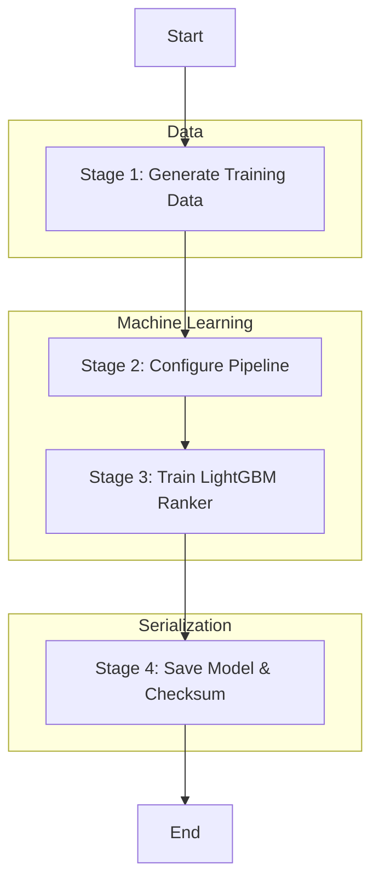

# Pipeline: Model Trainer

## Entry Point
- **File**: `train_and_save_models.py`
- **Trigger**: `train_and_save()`
- **Input**: None (generates synthetic data)

## Stage Map

## Stage Details

### Stage 1 — Generate Training Data
- **Files involved**: `train_and_save_models.py`, `training_data_generator.py`
- **Functions called**: `training_data_generator.py::generate_insight_dataset`
- **Input**: Configuration params (`n_samples`, etc.)
- **Output**: `X_train`, `X_test`, `y_train`, `y_test` (pandas DataFrames/Series)
- **I/O operations**: None
- **Shared state touched**: None
- **Failure behavior**: Process crash
- **Retry / fallback**: None

### Stage 2 — Configure Pipeline
- **Files involved**: `train_and_save_models.py`
- **Functions called**: `sklearn.compose.ColumnTransformer`, `sklearn.pipeline.Pipeline`, `lightgbm.LGBMClassifier`
- **Input**: Feature lists (`NUMERIC_FEATURES`, `CATEGORICAL_FEATURES`)
- **Output**: Unfitted `sklearn.pipeline.Pipeline` instance
- **I/O operations**: None
- **Shared state touched**: None
- **Failure behavior**: Process crash
- **Retry / fallback**: None

### Stage 3 — Train LightGBM Ranker
- **Files involved**: `train_and_save_models.py`
- **Functions called**: `pipeline.fit`
- **Input**: `X_train`, `y_train["insight_type"].values`
- **Output**: Fitted Pipeline
- **I/O operations**: None
- **Shared state touched**: None
- **Failure behavior**: Process crash
- **Retry / fallback**: None

### Stage 4 — Save Model & Checksum
- **Files involved**: `train_and_save_models.py`, `insight_model.py`
- **Functions called**: `pickle.dump`, `insight_model.py::_compute_checksum`
- **Input**: Fitted Pipeline, `model_path`
- **Output**: Saved file and checksum string
- **I/O operations**: Write `models/insight_ranker.pkl` and `models/insight_ranker.pkl.sha256`
- **Shared state touched**: None
- **Failure behavior**: Process crash
- **Retry / fallback**: None

## Full Execution Trace
`train_and_save_models.py::train_and_save`
  → `training_data_generator.py::generate_insight_dataset`
  → Setup `sklearn.pipeline.Pipeline`
  → `pipeline.fit`
  → `pickle.dump`
  → `insight_model.py::_compute_checksum`
  → Write checksum file
