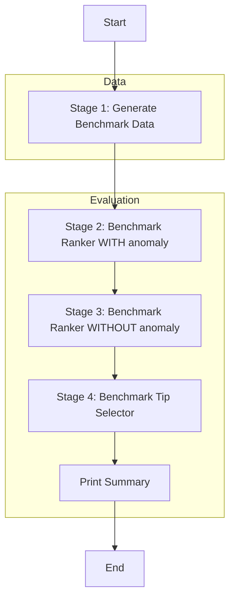

# Pipeline: Model Benchmark

## Entry Point
- **File**: `model_benchmark.py`
- **Trigger**: `main()`
- **Input**: None (generates synthetic data)

## Stage Map

## Stage Details

### Stage 1 — Generate Benchmark Data
- **Files involved**: `model_benchmark.py`, `training_data_generator.py`
- **Functions called**: `training_data_generator.py::generate_insight_dataset`
- **Input**: Configuration params
- **Output**: `X_train`, `X_test`, `y_train`, `y_test`
- **I/O operations**: None
- **Shared state touched**: None
- **Failure behavior**: Process crash
- **Retry / fallback**: None

### Stage 2 — Benchmark Ranker WITH anomaly
- **Files involved**: `model_benchmark.py`
- **Functions called**: `run_benchmark`, `format_results_table`, `print_classification_report_top`, `generate_feature_importance`
- **Input**: Training data, `include_anomaly=True`
- **Output**: Evaluation metrics, prints to stdout
- **I/O operations**: Print to stdout
- **Shared state touched**: None
- **Failure behavior**: Process crash
- **Retry / fallback**: None

### Stage 3 — Benchmark Ranker WITHOUT anomaly
- **Files involved**: `model_benchmark.py`
- **Functions called**: `run_benchmark`, `format_results_table`, `print_classification_report_top`
- **Input**: Training data, `include_anomaly=False`
- **Output**: Evaluation metrics, prints to stdout
- **I/O operations**: Print to stdout
- **Shared state touched**: None
- **Failure behavior**: Process crash
- **Retry / fallback**: None

### Stage 4 — Benchmark Tip Selector
- **Files involved**: `model_benchmark.py`
- **Functions called**: `run_benchmark`, `format_results_table`, `print_classification_report_top`, `generate_feature_importance`
- **Input**: Training data (with `insight_type_feature` added), target `tip_id`
- **Output**: Evaluation metrics, prints to stdout
- **I/O operations**: Print to stdout
- **Shared state touched**: None
- **Failure behavior**: Process crash
- **Retry / fallback**: None

## Full Execution Trace
`model_benchmark.py::main`
  → `training_data_generator.py::generate_insight_dataset`
  → `run_benchmark` (Insight Ranker, include_anomaly=True)
  → `format_results_table` & print
  → `generate_feature_importance` & print
  → `run_benchmark` (Insight Ranker, include_anomaly=False)
  → `format_results_table` & print
  → Set up Tip Selector Data
  → `run_benchmark` (Tip Selector)
  → `format_results_table` & print
  → `generate_feature_importance` & print
  → Print Summary
