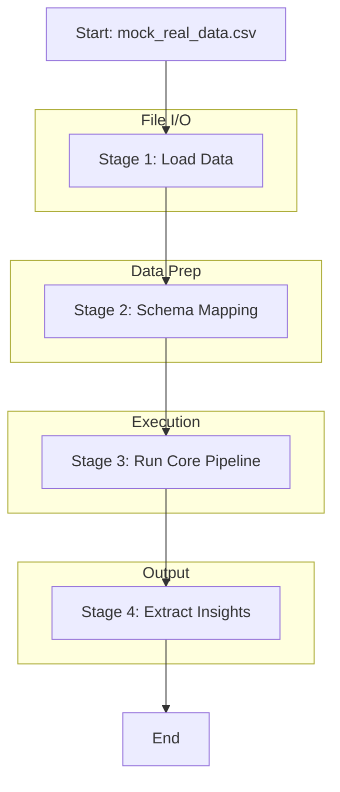

# Pipeline: Real Data Tutorial

## Entry Point
- **File**: `tutorial_real_data.py`
- **Trigger**: `if __name__ == "__main__":` block calling `run_real_data_tutorial(mock_file)`
- **Input**: Hardcoded mock CSV `mock_real_data.csv` (Shape: 5 rows x 4 columns)

## Stage Map

## Stage Details

### Stage 1 — Load Data
- **Files involved**: `tutorial_real_data.py`
- **Functions called**: `pandas.read_csv`, `pandas.read_json`, `pandas.read_parquet`
- **Input**: `file_path` (string)
- **Output**: `raw_df` (pandas DataFrame, Shape: N x 4 raw columns)
- **I/O operations**: Read input file from disk.
- **Shared state touched**: None
- **Failure behavior**: Raised `ValueError` if file type is unsupported. Exception propagates.
- **Retry / fallback**: None

### Stage 2 — Schema Mapping
- **Files involved**: `tutorial_real_data.py`
- **Functions called**: `raw_df.rename(columns=mapping)`
- **Input**: `raw_df` (pandas DataFrame, Shape: N x 4 raw columns)
- **Output**: `raw_df` (pandas DataFrame, Shape: N x 4 mapped columns: DATE, AMOUNT, AMOUNT_FLAG, REMARKS)
- **I/O operations**: None
- **Shared state touched**: None
- **Failure behavior**: Raised `ValueError` if required columns are missing after mapping. Exception propagates.
- **Retry / fallback**: None

### Stage 3 — Run Core Pipeline
- **Files involved**: `tutorial_real_data.py`, `pipeline.py`
- **Functions called**: `pipeline.py::run_pipeline`
- **Input**: `raw_df` (pandas DataFrame, Shape: N x 4 mapped columns)
- **Output**: `result` (PipelineResult object containing DataFrame and list of insights)
- **I/O operations**: Core pipeline I/O (see 01_insight_engine.md)
- **Shared state touched**: None
- **Failure behavior**: Exception handled internally by core pipeline, or propagates if unhandled.
- **Retry / fallback**: None

### Stage 4 — Extract Insights
- **Files involved**: `tutorial_real_data.py`
- **Functions called**: `print`
- **Input**: `result.insights` (List of strings)
- **Output**: Output to stdout
- **I/O operations**: Write to stdout
- **Shared state touched**: None
- **Failure behavior**: None
- **Retry / fallback**: None

## Full Execution Trace
`tutorial_real_data.py::if __name__ == "__main__"`
  → Create mock CSV
  → `tutorial_real_data.py::run_real_data_tutorial`
  → `pandas.read_csv`
  → DataFrame `rename`
  → Column validation check (raises ValueError if missing)
  → `pipeline.py::run_pipeline`
  → Loop over `result.insights` and print
  → Finally: Remove mock CSV
