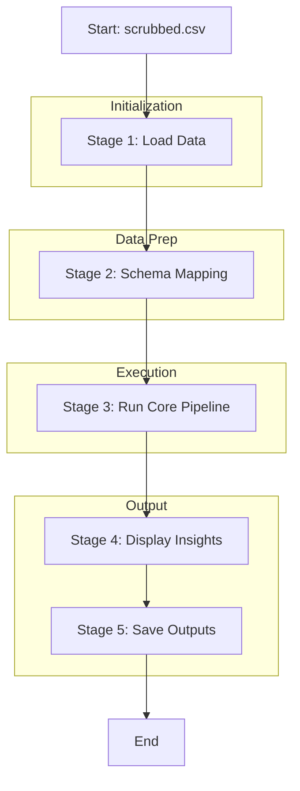

# Pipeline: Demo

## Entry Point
- **File**: `demo.py`
- **Trigger**: Script execution
- **Input**: Hardcoded path to `scrubbed.csv` (Shape: N rows)

## Stage Map

## Stage Details

### Stage 1 — Load Data
- **Files involved**: `demo.py`
- **Functions called**: `pandas.read_csv`
- **Input**: Hardcoded string path (`/home/priyadeep/.../scrubbed.csv`)
- **Output**: `my_data` (pandas DataFrame, Shape: N x raw columns)
- **I/O operations**: Read input file from disk.
- **Shared state touched**: Environment variable `INSIGHT_ENGINE_PASSION_ENABLED` is set.
- **Failure behavior**: Process crash if file not found.
- **Retry / fallback**: None

### Stage 2 — Schema Mapping
- **Files involved**: `demo.py`
- **Functions called**: `my_data.rename(columns=...)`
- **Input**: `my_data` (pandas DataFrame, Shape: N x raw columns)
- **Output**: `my_data` (pandas DataFrame, Shape: N x mapped columns: DATE, AMOUNT_FLAG, AMOUNT, REMARKS)
- **I/O operations**: None
- **Shared state touched**: None
- **Failure behavior**: Process crash if columns don't match.
- **Retry / fallback**: None

### Stage 3 — Run Core Pipeline
- **Files involved**: `demo.py`, `pipeline.py`
- **Functions called**: `pipeline.py::run_pipeline`
- **Input**: `my_data` (pandas DataFrame, Shape: N x mapped columns)
- **Output**: `results` (PipelineResult object)
- **I/O operations**: Core pipeline I/O
- **Shared state touched**: None
- **Failure behavior**: Exception handled internally by core pipeline, or propagates.
- **Retry / fallback**: None

### Stage 4 — Display Insights
- **Files involved**: `demo.py`, `summary_utils.py`
- **Functions called**: `print`, `summary_utils.py::print_summary`
- **Input**: `results` (PipelineResult object)
- **Output**: Output to stdout
- **I/O operations**: Write to stdout
- **Shared state touched**: None
- **Failure behavior**: Process crash on attribute errors.
- **Retry / fallback**: None

### Stage 5 — Save Outputs
- **Files involved**: `demo.py`
- **Functions called**: `os.makedirs`, `DataFrame.to_csv`
- **Input**: `results.personal_debits`, `results.personal_credits`, `results.passion_debits` (pandas DataFrames)
- **Output**: CSV files
- **I/O operations**: Write `known_person_debits.csv`, `known_person_credits.csv`, `passion_enriched_debits.csv` to `output` directory.
- **Shared state touched**: None
- **Failure behavior**: Process crash on write failure.
- **Retry / fallback**: None

## Full Execution Trace
`demo.py` execution
  → Set `os.environ["INSIGHT_ENGINE_PASSION_ENABLED"] = "true"`
  → `pandas.read_csv`
  → DataFrame `rename`
  → `pipeline.py::run_pipeline`
  → Print CORE INSIGHTS loop
  → Check `passion_status`
  → Print PASSION INSIGHTS loop (if success)
  → Print PASSION SIGNALS loop (if success)
  → `summary_utils.py::print_summary`
  → Create `output` directory
  → (if personal debits) Write to CSV
  → (if personal credits) Write to CSV
  → (if passion success and debits) Write to CSV
